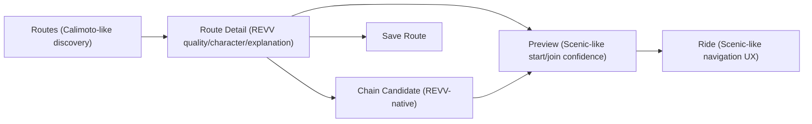

# REVV UX Benchmark

Last checked: 2026-04-16

## Decision Summary
- Primary benchmark: `Calimoto`
- Ride-time benchmark: `Scenic`
- Routing control benchmark: `Kurviger`
- Community/save reference only: `REVER`

This is not a copy plan. It is a decomposition plan. REVV should not imitate one product end-to-end because the market leaders each dominate different layers.

## What REVV Should Copy

### Routes
- Follow `Calimoto`.
- Why:
  - Best route discovery framing.
  - Round-trip generation is simple and legible.
  - Result list feels like `pick a good ride now`, not `configure a routing engine`.
- REVV difference:
  - Each route card should expose `quality`, `character`, and `primary reason`.
  - `fun + flow + residential` should be visible as product logic, not hidden backend scoring.

### Route Detail
- Follow `Calimoto` for overall structure, then add REVV-specific explanation depth.
- Why:
  - Route detail should still feel lightweight and selection-oriented.
  - Overloading it with planner settings would move it toward Kurviger too early.
- REVV difference:
  - Show `route_character`, `primary_reason`, `caution_note`, and optional `chain candidate` recommendations.

### Preview
- Hybrid: `Calimoto` structure + `Scenic` execution detail.
- Why:
  - Preview is where REVV can bridge discovery and ride confidence.
  - Scenic is stronger at showing start/join logic and navigation readiness.
- REVV difference:
  - Show whether the route is `keep` or `maybe`.
  - Show whether route chaining adds or hurts flow.

### Ride
- Follow `Scenic`.
- Why:
  - Scenic is the clearest benchmark for active navigation, CarPlay-scale interaction, detour/rejoin handling, and route join behavior.
- REVV difference:
  - Keep the visual surface simple.
  - Surface only the route attributes that help while riding: `next action`, `rejoin state`, `detour impact`, `chain segment state`.

### Saved / Audit
- Saved follows `REVER` lightly.
- Audit is REVV-native.
- Why:
  - REVER has the strongest library/community framing.
  - But REVV's route audit and quality inspection are internal product capabilities, not social product features.
- REVV difference:
  - Keep `route-audit` as an internal tooling surface.
  - For user-facing saved routes, keep the structure simple and route-centric.

## What REVV Should Not Copy
- Do not copy Kurviger's full control surface into the default route flow.
- Do not copy REVER's community-first framing into V1.
- Do not copy Calimoto's opacity around why a route is good.
- Do not copy Scenic's planner complexity where external import compensates for weak in-app shaping.

## Recommended REVV Product Shape

## Screen-Level Benchmark Decision

| Screen | Primary benchmark | What to copy | What REVV adds |
| --- | --- | --- | --- |
| Routes | Calimoto | Discovery-first list, round-trip framing, quick selection | quality/character/reason |
| Route Detail | Calimoto | Lightweight route decision screen | caution note, flow-aware explanation, chain suggestions |
| Preview | Scenic | start/join clarity, navigation readiness | quality label and chain impact |
| Ride | Scenic | map/nav behavior, rejoin logic, glove-friendly controls | route-chain context, route-quality-aware reroute hints |
| Saved | REVER | route library framing | simpler, less social V1 |
| Audit | REVV-native | none | internal quality/debug/research surface |

## Immediate UI Priority List
1. Make `Routes` explicitly Calimoto-like in structure, not planner-like.
2. Make `Ride` explicitly Scenic-like in detour/rejoin and route-start behavior.
3. Keep Kurviger-style controls behind an advanced layer.
4. Keep REVER-style community features out of the main V1 route flow.
5. Put REVV differentiation on the route card and route detail explanation layer.

## Source Index
- [Calimoto official site](https://calimoto.com/en)
- [Calimoto Twisty Algorithm](https://support.calimoto.com/hc/en-us/articles/10514787546908-Our-Twisty-Roads-Algorithm)
- [Calimoto Round Trip planning](https://support.calimoto.com/hc/en-us/articles/7989918956572-How-Do-I-Plan-a-Round-Trip)
- [Scenic official site](https://scenic.app/)
- [Scenic help center](https://scenic.app/help/)
- [Scenic route start/rejoin behavior](https://scenic.app/help/start-a-route-in-the-middle/)
- [Kurviger docs home](https://docs.kurviger.com/)
- [Kurviger basics](https://docs.kurviger.com/web/faq/basics)
- [Kurviger route planning manual](https://docs.kurviger.com/app/manual/route)
- [REVER getting started](https://www.rever.co/help/getting-started)
- [REVER FAQ](https://www.rever.co/faqs)
- [REVER communities](https://www.rever.co/post/how-to-use-communities-in-rever)
